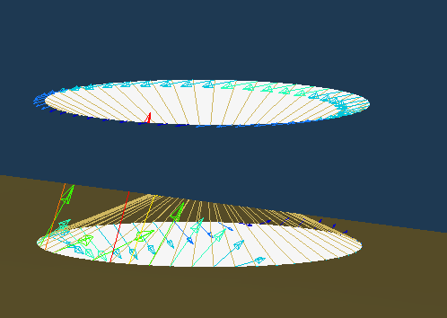

# Welcome to MPCForces-Extractor

This tool extracts the forces from Altair Optistruct Runs from RBEs and it sums them up by connected parts autoamtically.

## Motivation

When you have simple rigid elements for modelling bolts, the mpcforces can be written out to either .h3d or .mpcf file among other options. With these options there seems to be no easy way of getting the summed up forces per conneced part for every mpc elmeent. Below you can see an image with the mpc forses printed as a vector plot. In the image there are two connected parts. To manually get the desired force per part you have to go into hyperview, do a table export and sum them up. This also requires you to have sets or to manually select the nodes per part. For a multitude of mpc elements this process is a problem.

The desired process is this:

This tool is destined to solve this by automating it. The two major problems regarding this:

- Detect the connected parts with in an efficient way
- Read the mpcf File and assign each force to the mpc element (as this is not printed in the mpcf file)

## Functionality

This tool comes with different methods of using it

### [Command Line Interface (CLI)](cli.md)

Recommended if you want to process a lot of files with small scripts and text output is enough.

### [App](app.md)

Recommended if you want to get to know the tool or if you want to explore previous run models again (= import database).

### [Pure Python](source_code.md)

You also can use the tool directly. Exmaple is provided [here](source_code.md).

## Basic Functionality (Backend)

The tool operates in the following way. CLI / App just shows the Input / Ouput.

- Detect RBE2 and RBE3 elements in your model
- Do a group segmentation for all connected (not by RBE2/RBE3) parts
- Ouput sums of forces per RBE Element and therefore showing you how much force is being transfereed by which RBE Element to which part

where:

- Part: A element collection which are connected to each other (ignoring all RBE Elements). For the Hypermesh user: Its "by attached" but without considering RBE Elements
- RBE: Rigid Body Element. Currently RBE2 and RBE3 Elements are supported

## Acknowledgements

- Thanks to [Codie](https://github.com/codie3611), because without him my python skills would not be nearly as mediocre as they are ;)
- Thank you dear Wulu Tea for keeping me running at night
